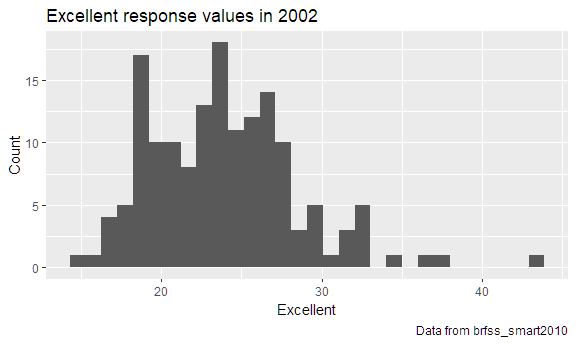
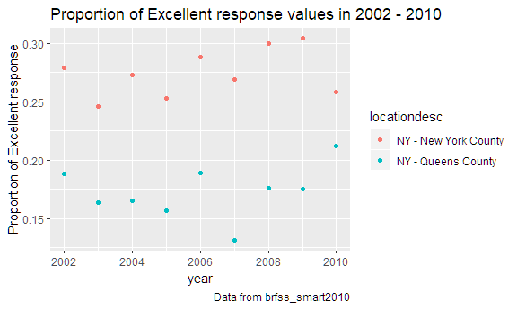

p8105\_hw2\_yc3242
================
Youn Kyeong Chang (uni\# yc3242)
October 3, 2018

I used the tidyverse library through the whole problem set.

``` r
library(tidyverse)
```

    ## -- Attaching packages -------------------------------------------------------- tidyverse 1.2.1 --

    ## v ggplot2 3.0.0     v purrr   0.2.5
    ## v tibble  1.4.2     v dplyr   0.7.6
    ## v tidyr   0.8.1     v stringr 1.3.1
    ## v readr   1.1.1     v forcats 0.3.0

    ## -- Conflicts ----------------------------------------------------------- tidyverse_conflicts() --
    ## x dplyr::filter() masks stats::filter()
    ## x dplyr::lag()    masks stats::lag()

Problem 1
=========

First, I loaded and cleaned dataset for problem 1.

``` r
nyc_data = 
  read_csv(file = "./hw2_data/NYC_Transit_Subway_Entrance_And_Exit_Data.csv") %>% 
  janitor::clean_names() %>% 
  select(line:entry, vending, ada) %>% 
  mutate(entry = recode(entry, "YES" = TRUE, "NO" = FALSE))
```

    ## Parsed with column specification:
    ## cols(
    ##   .default = col_character(),
    ##   `Station Latitude` = col_double(),
    ##   `Station Longitude` = col_double(),
    ##   Route8 = col_integer(),
    ##   Route9 = col_integer(),
    ##   Route10 = col_integer(),
    ##   Route11 = col_integer(),
    ##   ADA = col_logical(),
    ##   `Free Crossover` = col_logical(),
    ##   `Entrance Latitude` = col_double(),
    ##   `Entrance Longitude` = col_double()
    ## )

    ## See spec(...) for full column specifications.

This NYC Transit data (`nyc_data`) is composed of *line, station name, its latitude and longitude, routes it serves, entrance type, whether or not you can enter the station, presence of ticket vending machine*, and *ADA compliance*. These variables were selected from `NYC_Transit_Subway_Entrance_And_Exit_Data.csv` original dataset which was followed by `clean_names()` function in the janitor library. After selecting variables process, `entry` variable was converted from character variable to logical variable. The **size** of the NYC Transit data is **1868 rows** and **19** columns. These data are not tidy because columns are values not variables and there are many duplicated rows.

To remove duplicated rows, I used `distinct()` function as below:

``` r
nyc_data = distinct(nyc_data)
```

The **size** of the NYC Transit data is now 684 rows and 19 columns.

### Questions

**1.1. How many distinct stations are there?**

``` r
nyc_data %>% 
  distinct(line, station_name, .keep_all = TRUE) %>% 
  count()
```

    ## # A tibble: 1 x 1
    ##       n
    ##   <int>
    ## 1   465

There are **465** distinct stations.

**1.2. How many stations are ADA compliant?**

``` r
nyc_data %>% 
  distinct(line, station_name, .keep_all = TRUE) %>% 
  filter(ada == TRUE) %>% 
  count(ada)
```

    ## # A tibble: 1 x 2
    ##   ada       n
    ##   <lgl> <int>
    ## 1 TRUE     84

There are **84** ADA compliant stations.

**1.3. What proportion of station entrances / exits without vending allow entrance?**

``` r
nyc_data %>% 
  filter(vending == "NO") %>% 
  summarise(mean(entry == TRUE))
```

    ## # A tibble: 1 x 1
    ##   `mean(entry == TRUE)`
    ##                   <dbl>
    ## 1                 0.385

The proportion of station entrances / exits without vending allow entrance is **0.385**.

**1.4. How many distinct stations serve the A train?**

To answer the questions 1.4. and 1.5., I reformatted data as below so that route number and route name are distinct variables.

``` r
reform_nyc_data = 
  nyc_data %>%
  gather(key = "route", value = "route_name", route1:route11) %>%  # gather spreading route variables
  separate(route, into = c("remove", "route_number"), sep = 5) %>% 
  select(-remove)
```

And then, I calculated distinct stations serve the A train.

``` r
reform_nyc_data %>% 
  distinct(line, station_name, route_name) %>%
  filter(route_name == "A") %>%
  count()
```

    ## # A tibble: 1 x 1
    ##       n
    ##   <int>
    ## 1    60

There are **60** distinct stations serve A train.

**1.5. Of the stations that serve the A train, how many are ADA compliant?**

``` r
reform_nyc_data %>% 
  distinct(line, station_name, route_name, .keep_all = TRUE) %>%
  filter(route_name == "A", ada == "TRUE") %>%
  count()
```

    ## # A tibble: 1 x 1
    ##       n
    ##   <int>
    ## 1    17

There are **17** ADA compliant distinct stations serve A train.

Problem 2
=========

I I used the readxl library to read `xlsx` file for problem 2.

``` r
library(readxl)
```

### Mr. Trash Wheel

I read and clean the Mr. Trash Wheel sheet as follows.

``` r
trash_data = 
  read_excel(path = "./hw2_data/HealthyHarborWaterWheelTotals2018-7-28.xlsx",
                     sheet = 1, range = cell_cols("A:N")) %>% 
  janitor::clean_names() %>%                              # use reasonable variable names
  filter(!is.na(dumpster)) %>%                            # omit NA data
  mutate(sports_balls = as.integer(round(sports_balls)))  # round and convert sports_ball
```

-   The **number of observations** is **285**.
-   I think the **key variables** are `month` and `year` since in general, we can analyze the total amount of trash or each kind of trash by them.
-   The **median** number of sports balls in a dumpster in 2016 is **26**.

### Precipiation data

I read and clean precipitation data for 2016.

``` r
precip_2016 = 
  read_excel(path = "./hw2_data/HealthyHarborWaterWheelTotals2018-7-28.xlsx",
                     sheet = 5, skip = 1) %>% 
  janitor::clean_names() %>%    
  rename(total_precip = total) %>%                    # use reasonable variable names
  filter(!is.na(month) & !is.na(total_precip)) %>%    # omit NA data
  mutate(year = 2016)                                 # add a variable year
```

Next, I read and clean precipitation data for 2017.

``` r
precip_2017 = 
  read_excel(path = "./hw2_data/HealthyHarborWaterWheelTotals2018-7-28.xlsx",
                     sheet = 4, skip = 1) %>% 
  janitor::clean_names() %>% 
  rename(total_precip = total) %>%                  # use reasonable variable names
  filter(!is.na(month) & !is.na(total_precip)) %>%  # omit NA data
  mutate(year = 2017)                               # add a variable year
```

And then, I combined these datasets and converted month to a character variable.

``` r
precip_data = bind_rows(precip_2016, precip_2017) %>% 
              mutate(month = month.name[month])
```

-   The **number of observations** is **24**.
-   In this case, `month` and `year` can be considered as **key variables** since, for example, we can see the trends of precipitation by month and compare the amount of precipitation in years.
-   The **total precipitation** in 2017 is **32.93**(in).

Problem 3
=========

First, I loaded the dataset for problem 3 from the library.

``` r
library(p8105.datasets)
data("brfss_smart2010")
```

Next, I cleaned the data and focused on the `Overall Health` topic and excluded some variables and added a new variable showing the proportion of responses that were "Excellent" or "Very Good".

``` r
brfss_data = brfss_smart2010 %>% 
  janitor::clean_names() %>%                          # clean variable names
  filter(topic == "Overall Health") %>%               # focus on the "Overall Health" topic
  select(-c(class, topic, question, sample_size, 
            confidence_limit_low:geo_location)) %>%   # exclude variables
  spread(key = response, value = data_value) %>%      # redefine columns
  janitor::clean_names() %>%                          # clean variable names for new columns
  mutate(exc_vg_prop = (excellent + very_good) /   
           rowSums(select(., excellent:very_good))) %>%  # create proportion variable
  select(year:excellent, very_good, good, fair, poor, exc_vg_prop) # reorder columns
```

### Questions

**3.1. How many unique locations are included in the dataset?**

There are **404** unique locations are included in the dataset.

**3.2. Is every state represented?**

**Yes**. Because **51** states including DC is represented.

**3.3. What state is observed the most?**

``` r
brfss_data %>% count(locationabbr) %>% arrange(desc(n))
```

    ## # A tibble: 51 x 2
    ##    locationabbr     n
    ##    <chr>        <int>
    ##  1 NJ             146
    ##  2 FL             122
    ##  3 NC             115
    ##  4 WA              97
    ##  5 MD              90
    ##  6 MA              79
    ##  7 TX              71
    ##  8 NY              65
    ##  9 SC              63
    ## 10 CO              59
    ## # ... with 41 more rows

**`NJ`** is observed the most.

**3.4. In 2002, what is the median of the “Excellent” response value?**

``` r
brfss_data %>% 
  filter(year == 2002) %>% 
  summarise(median(excellent, na.rm = TRUE)) # missing values are stripped
```

    ## # A tibble: 1 x 1
    ##   `median(excellent, na.rm = TRUE)`
    ##                               <dbl>
    ## 1                              23.6

The **median** of the "Excellent" response value is **23.6** in 2002.

### Plots

Before I make some plots, I embedded the following code snippet to adjust figure size.

``` r
knitr::opts_chunk$set(
  fig.width = 6,
  fig.asp = .6,
  out.width = "90%"
)
```

I visualized “Excellent” response values in the year 2002 by histogram.

``` r
brfss_data %>% 
  filter(year == 2002) %>% 
  ggplot(aes(x = excellent)) + 
  geom_histogram() + 
  labs(
    title = "Excellent response values in 2002",
    x = "Excellent",
    y = "Count",
    caption = "Data from brfss_smart2010"
  )
```

    ## `stat_bin()` using `bins = 30`. Pick better value with `binwidth`.

    ## Warning: Removed 2 rows containing non-finite values (stat_bin).



The scatterplot below shows the proportion of “Excellent” response values in New York County and Queens County (both in NY State) in each year from 2002 to 2010.

``` r
brfss_data %>% 
  filter(year >= 2002 & year <= 2010) %>% 
  filter(locationdesc %in% c("NY - New York County", "NY - Queens County")) %>%
  mutate(exc_prop = (excellent) / rowSums(select(., excellent:poor))) %>% 
  ggplot(aes(x = year, y = exc_prop, color = locationdesc)) +
  geom_point() +
  labs(
    x = "year",
    y = "Proportion of Excellent response",
    title = "Proportion of Excellent response values in 2002 - 2010"
  )
```


